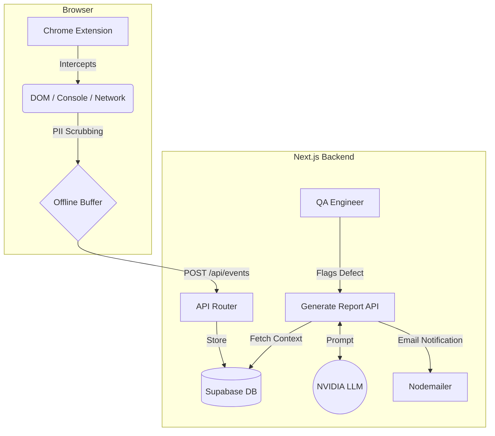

# 🕵️‍♂️ Silent QA Hackathon


Welcome to **Silent QA**, a next-generation automated QA telemetry and reporting tool designed for the TCS Technology Day Hackathon. 

This project bridges the gap between end-users and engineering teams by silently capturing critical frontend errors, generating AI-powered defect reports using the NVIDIA API, and automatically emailing them to the QA team—all without requiring the user to write a single line of technical bug reporting.

## 🌟 Key Features

1. **Silent Telemetry Engine (Chrome Extension)**
   - Automatically intercepts unhandled JS crashes, console errors, and 500 Network failures.
   - **Enterprise Security:** Built-in Regex PII-Scrubbing to mask emails, phone numbers, and credit cards before they leave the browser.
   - **DOM Snapshotting:** Captures the exact state of the HTML at the millisecond a critical error occurs.
   - **Offline Resilience:** Leverages `chrome.storage.local` to safely buffer events if the backend API goes offline.

2. **AI-Powered Defect Analysis**
   - Connects to the **NVIDIA AI LLM (Meta Llama 3.1 8B Instruct)**.
   - Automatically cross-references vague user complaints (e.g., "The cart is broken") with silent telemetry to generate highly structured, technical bug reports (Steps to Reproduce, Expected Results, Root Cause Hypothesis).
   - **Graceful Failover:** Robust backend `AbortControllers` ensure that if the AI API hangs, the UI gracefully injects a sanitized fallback message instead of crashing.

3. **Hyper-Premium Dashboard**
   - A stunning **Cyberpunk Glassmorphism** UI built on Next.js 16.
   - Interactive chat interface for QA engineers to query intercepted logs.

## 🏗️ Architecture



## 🚀 Getting Started

### 1. Environment Setup
Create a `.env.local` file with your credentials:
```env
NEXT_PUBLIC_SUPABASE_URL=your_supabase_url
NEXT_PUBLIC_SUPABASE_ANON_KEY=your_supabase_key

NVIDIA_API_KEY=your_nvidia_key
NVIDIA_MODEL=meta/llama-3.1-8b-instruct

GMAIL_USER=your_email@gmail.com
GMAIL_APP_PASSWORD=your_app_password
```

### 2. Run the Next.js Server
```bash
npm install
npm run dev
```

### 3. Load the Extension
1. Open Chrome and navigate to `chrome://extensions/`
2. Enable **Developer mode**.
3. Click **Load unpacked** and select the `/extension` directory from this repository.

## 🛠️ Built For
- TCS Technology Day Hackathon
- Modern QA and SRE Engineering Teams

---
*Developed with Next.js 16 (Turbopack) & NVIDIA AI*
