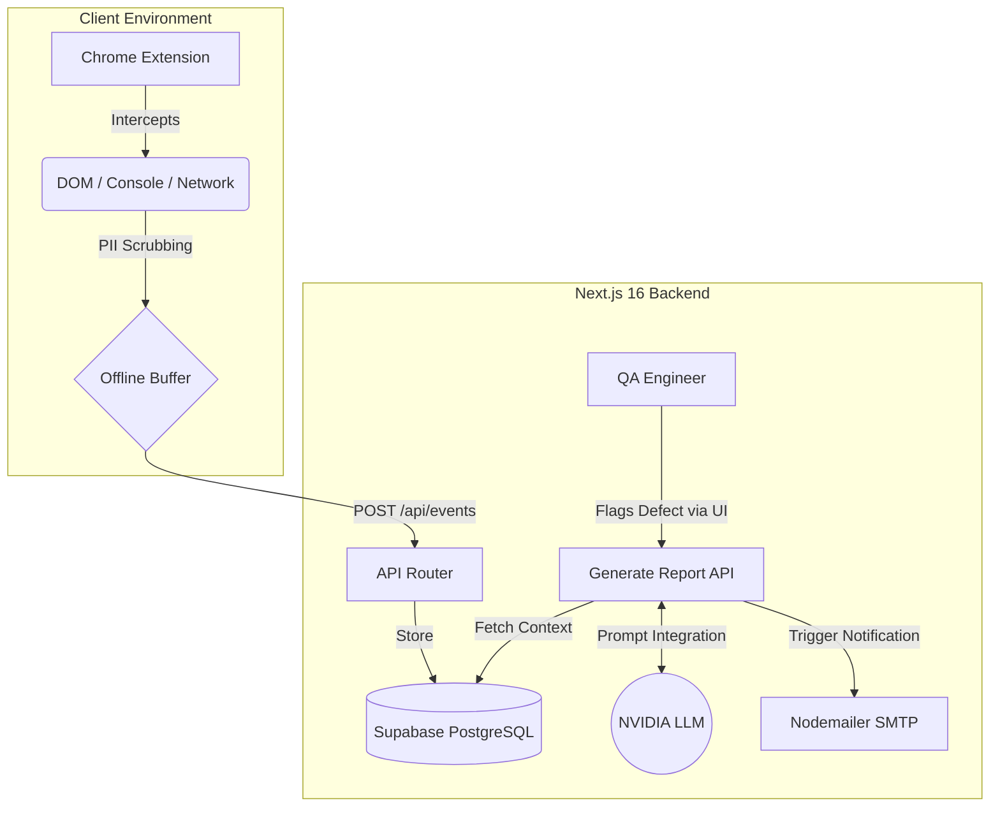

# 🕵️‍♂️ Silent QA — Intelligent Telemetry & AI Defect Reporting


**Silent QA** is a next-generation automated Quality Assurance telemetry and reporting engine designed for the **TCS Technology Day Hackathon**. 

It bridges the critical communication gap between non-technical end-users and engineering teams by silently capturing frontend telemetry, generating AI-powered defect reports using the **NVIDIA AI API**, and automatically notifying QA teams—all without requiring the user to write a single line of technical bug reporting.

---

## 🎯 The Problem
In modern software development, bug reports from end-users or manual testers often lack the technical context required for engineers to actually fix the issue. A report saying *"The checkout page is broken"* provides zero actionable data. Engineers spend hours attempting to reproduce issues, digging through server logs, and guessing at the client-side state.

## 💡 Our Solution
**Silent QA** eliminates the guesswork. Our Chrome Extension silently runs in the background of your web application, acting as a flight data recorder for the browser. When a user experiences an issue, they simply type a vague description (e.g., *"The cart button didn't work"*). 

Our backend instantly cross-references their complaint with the silent telemetry (Network errors, JS crashes, DOM mutations), feeds this context into **Meta Llama 3.1 8B Instruct (via NVIDIA API)**, and generates a highly structured, enterprise-grade technical defect report.

---

## 🌟 Enterprise-Grade Features

### 1. 🛡️ Silent Telemetry Engine (Chrome Extension V3)
- **Comprehensive Monitoring:** Automatically intercepts unhandled JS crashes (`window.onerror`), console errors, and HTTP 500 Network failures (`fetch` / `XHR`).
- **Security & Compliance First:** Built-in aggressive Regex **PII-Scrubbing** masks emails, phone numbers, credit cards, and authentication tokens before the payload ever leaves the user's browser.
- **Critical DOM Snapshotting:** If a severe error occurs, the extension captures the exact sanitized state of the HTML at that specific millisecond, providing unparalleled context.
- **Offline Resilience:** Leverages native `chrome.storage.local` to safely buffer and queue events if the backend API experiences downtime.

### 2. 🧠 AI-Powered Defect Analysis
- **NVIDIA AI Integration:** Utilizes the cutting-edge **NVIDIA API** to power our defect analysis engine.
- **Contextual Synthesis:** Automatically cross-references vague user complaints with hard telemetry to deduce root causes.
- **Structured Output:** Generates reports containing *Steps to Reproduce*, *Expected Results*, *Actual Results*, and a *Root Cause Hypothesis*.
- **Graceful Degradation:** Robust backend `AbortControllers` ensure that if the AI API hangs or goes offline, the UI gracefully injects a sanitized fallback message instead of crashing the application.

### 3. 🎨 Hyper-Premium QA Dashboard
- **Cyberpunk Glassmorphism UI:** A stunning, immersive frontend built on **Next.js 16 (Turbopack)** featuring animated floating mesh gradients and glowing glass cards.
- **Real-time QA Chatbot:** An interactive chat interface allowing QA engineers to naturally query intercepted logs and ask the AI for testing methodology advice.
- **Automated Nodemailer Integration:** Instantly formats the AI-generated defect payload into a clean HTML email and dispatches it directly to the QA team's inbox.

---

## 🏗️ System Architecture



---

## 🚀 Getting Started

### 1. Environment Setup
Create a `.env.local` file in the root directory with your credentials:
```env
# Supabase Configuration
NEXT_PUBLIC_SUPABASE_URL=your_supabase_url
NEXT_PUBLIC_SUPABASE_ANON_KEY=your_supabase_key

# NVIDIA AI Configuration
NVIDIA_API_KEY=your_nvidia_key
NVIDIA_MODEL=meta/llama-3.1-8b-instruct

# Nodemailer SMTP Configuration
GMAIL_USER=your_email@gmail.com
GMAIL_APP_PASSWORD=your_app_password
```

### 2. Run the Next.js Server
This project utilizes the blazing fast Turbopack bundler.
```bash
npm install
npm run dev
```

### 3. Load the Extension
1. Open Google Chrome and navigate to `chrome://extensions/`
2. Enable **Developer mode** in the top right corner.
3. Click **Load unpacked** and select the `/extension` directory from this repository.

---

## 📈 Business Value & ROI
- **Reduced MTTR (Mean Time To Resolution):** Engineers receive the exact stack trace and API failure logs instantly, eliminating the need to reproduce the bug.
- **Enhanced Security:** PII is scrubbed client-side, ensuring GDPR and HIPAA compliance while debugging production environments.
- **Empowered Manual Testers:** Non-technical QA staff can generate senior-engineer-level defect reports instantly.

---
*Developed for the TCS Technology Day Hackathon. Powered by Next.js 16, Supabase, and NVIDIA AI.*
